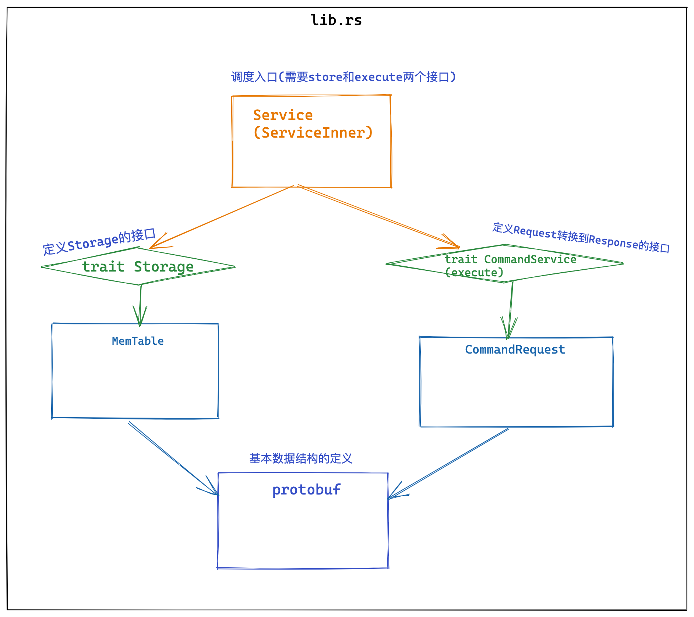

# kvserver
key-value server by rust.

 由多个分支及版本组成。最终完成的合并到 master 分支上.

## simple 架构



## 技术细节 

- 绝大多数处理逻辑都是把数据从一个接口转换成另一个接口.
- 感受到了这样一种模式：在 Rust 下，**但凡出现两个数据结构 v1 到 v2 的转换，你都可以先以 v1.into() 来表示这个逻辑，继续往下写代码，之后再去补 From<T> 的实现。** 如果`v1`和`v2`都不是你定义的数据结构，那么你需要把其中之一用`struct`包装一下，来绕过之前提到的**孤儿规则**。
- 首先`Service`结构内部有一个`ServiceInner`存放实际的数据结构，`Service`只是用`Arc`包裹了`ServiceInner`。这也是 Rust 的一个惯例，**把需要在多线程下 clone 的主体和其内部结构分开，这样代码逻辑更加清晰。**
    ```rust
    /// Service 数据结构
    pub struct Service<Store = MemTable> {
        inner: Arc<ServiceInner<Store>>,
    }

    impl<Store> Clone for Service<Store> {
        fn clone(&self) -> Self {
            Self {
                inner: Arc::clone(&self.inner),
            }
        }
    }

    /// Service 内部数据结构
    pub struct ServiceInner<Store> {
        store: Store,
    }

    impl<Store: Storage> Service<Store> {
        pub fn new(store: Store) -> Self {
            Self {
                inner: Arc::new(ServiceInner { store }),
            }
        }

        pub fn execute(&self, cmd: CommandRequest) -> CommandResponse {
            debug!("Got request: {:?}", cmd);
            // TODO: 发送on_received事件
            let res = dispatch(cmd, &self.inner.store);
            debug!("Executed response: {:?}", res);
            // TODO: 发送on_executed事件

            res
        }
    }
    ```

    **调用的地方**
    ```rust
    #[tokio::main]
    async fn main() -> Result<()> {
        let svc = service.clone();
        tokio::spawn(async move {
            let mut stream =
                AsyncProstStream::<_, CommandRequest, CommandResponse, _>::from(stream).for_async();
            while let Some(Ok(cmd)) = stream.next().await {
                info!("Got a new command: {:?}", cmd);
                let res = svc.execute(cmd);
                stream.send(res).await.unwrap();
            }
            info!("Client {:?} disconnected", addr);
        });
    }
    ```
- 所以需要构建接口来消弭不稳定的因素，让不稳定的部分可以用一种稳定的方式来管理。
- get_iter()时我们需要有一个能够完全占有 table 的迭代器。Rust 标准库里提供了一个 trait IntoIterator，它可以把数据结构的所有权转移到 Iterator 中，看它的声明
  ```rust
  pub trait IntoIterator {
    type Item;
    type IntoIter: Iterator<Item = Self::Item>;
    
    fn into_iter(self) -> Self::IntoIter;
  }
  ```